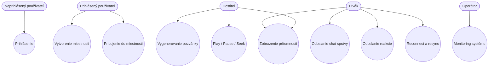
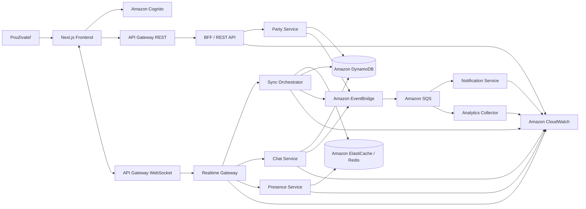
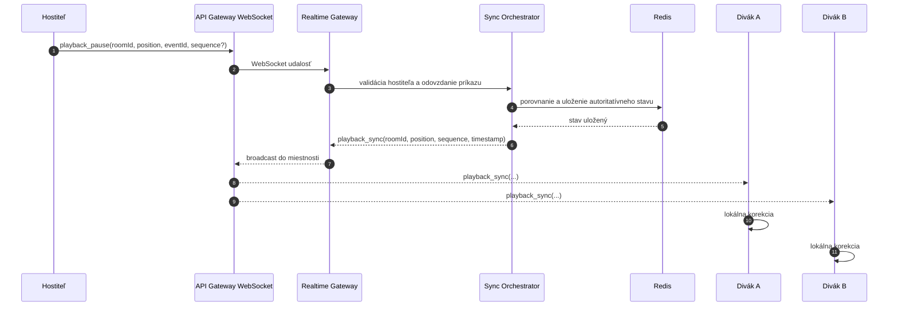
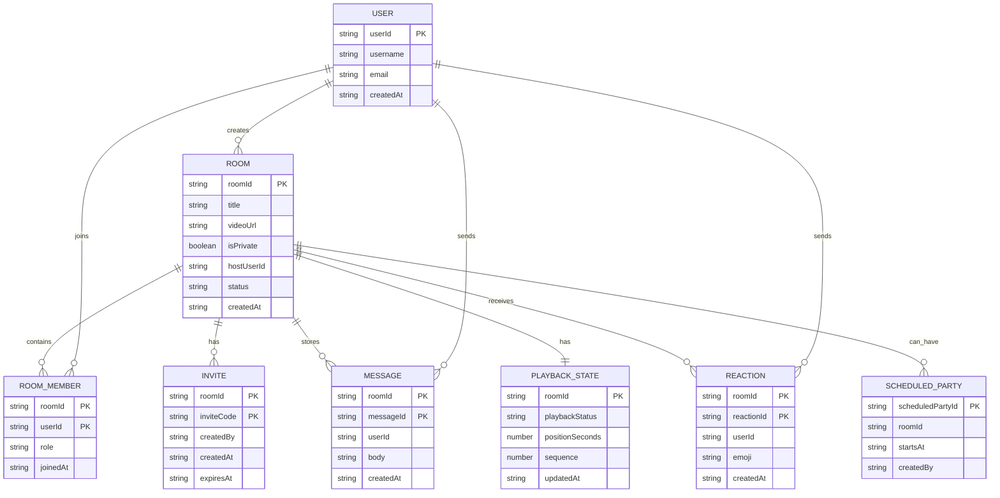

# WatchParty
## Špecifikácia a návrh cloudovej aplikácie pre predmet **Cloud Systems**

**Tím:** Lukáš Čeč, Matej Bendík, Miroslav Hanisko, Oliver Fecko, Benjamín Vateha  
**Akademický rok:** 2025/2026  
**Predmet:** Cloud Systems  

> Tento dokument opisuje **cieľový návrh** systému **WatchParty**.

---

## Obsah

- [1. Úvod](#1-úvod)
- [2. Prehľad projektu WatchParty](#2-prehľad-projektu-watchparty)
  - [2.1 Cieľ aplikácie](#21-cieľ-aplikácie)
  - [2.2 Hlavné funkcionality](#22-hlavné-funkcionality)
  - [2.3 MVP a rozšírené funkcionality](#23-mvp-a-rozšírené-funkcionality)
- [3. Analýza požiadaviek](#3-analýza-požiadaviek)
  - [3.1 Funkčné požiadavky](#31-funkčné-požiadavky)
  - [3.2 Nefunkčné požiadavky](#32-nefunkčné-požiadavky)
  - [3.3 Aktéri systému](#33-aktéri-systému)
  - [3.4 Používateľské prípady a scenáre](#34-používateľské-prípady-a-scenáre)
  - [3.5 Dáta, záťaž a izolácia miestností](#35-dáta-záťaž-a-izolácia-miestností)
- [4. Návrh architektúry systému](#4-návrh-architektúry-systému)
  - [4.1 Architektonický štýl](#41-architektonický-štýl)
  - [4.2 Hlavné komponenty systému](#42-hlavné-komponenty-systému)
  - [4.3 Dôvod rozdelenia na služby](#43-dôvod-rozdelenia-na-služby)
  - [4.4 Dôvod nasadenia do cloudu](#44-dôvod-nasadenia-do-cloudu)
  - [4.5 Diagram celkovej architektúry](#45-diagram-celkovej-architektúry)
- [5. Komunikácia a spracovanie dát](#5-komunikácia-a-spracovanie-dát)
  - [5.1 REST komunikácia](#51-rest-komunikácia)
  - [5.2 WebSocket komunikácia](#52-websocket-komunikácia)
  - [5.3 Messaging a asynchrónne spracovanie](#53-messaging-a-asynchrónne-spracovanie)
  - [5.4 Konzistencia dát a rozdelenie údajov](#54-konzistencia-dát-a-rozdelenie-údajov)
  - [5.5 Sekvenčný diagram synchronizácie](#55-sekvenčný-diagram-synchronizácie)
- [6. Návrh backendu](#6-návrh-backendu)
  - [6.1 Prehľad backend služieb](#61-prehľad-backend-služieb)
  - [6.2 Návrh API](#62-návrh-api)
  - [6.3 Návrh udalostí v realtime vrstve](#63-návrh-udalostí-v-realtime-vrstve)
  - [6.4 Dátový model](#64-dátový-model)
  - [6.5 Pseudokód pre Sync Orchestrator](#65-pseudokód-pre-sync-orchestrator)
- [7. Návrh frontendu](#7-návrh-frontendu)
  - [7.1 Typ frontendu a hlavné obrazovky](#71-typ-frontendu-a-hlavné-obrazovky)
  - [7.2 Používateľské scenáre](#72-používateľské-scenáre)
  - [7.3 Komunikácia frontend–backend cez API Gateway](#73-komunikácia-frontendbackend-cez-api-gateway)
- [8. Použité cloud technológie a služby](#8-použité-cloud-technológie-a-služby)
  - [8.1 Vybraná platforma](#81-vybraná-platforma)
  - [8.2 Použité AWS služby](#82-použité-aws-služby)
  - [8.3 Kontajnery, serverless a služby tretích strán](#83-kontajnery-serverless-a-služby-tretích-strán)
- [9. Dopad nasadenia do cloudu](#9-dopad-nasadenia-do-cloudu)
  - [9.1 Škálovanie a elasticita](#91-škálovanie-a-elasticita)
  - [9.2 Dostupnosť a liveness](#92-dostupnosť-a-liveness)
  - [9.3 Bezpečnosť a monitoring](#93-bezpečnosť-a-monitoring)
  - [9.4 Riziká a obmedzenia](#94-riziká-a-obmedzenia)
- [10. Záver](#10-záver)

---

## 1. Úvod

WatchParty je cloudová webová aplikácia určená na synchronizované sledovanie videa vo virtuálnych miestnostiach. Používateľ vytvorí miestnosť, pozve ďalších účastníkov a následne môžu všetci sledovať rovnaký obsah v rovnakom čase. Keď hostiteľ spustí, pozastaví alebo posunie video, rovnaká zmena sa má prejaviť aj u ostatných členov miestnosti.

Hlavným problémom, ktorý aplikácia rieši, je spojenie troch náročných vlastností:

1. **realtime synchronizácia prehrávania**,  
2. **interaktívna komunikácia medzi používateľmi**,  
3. **schopnosť zvládnuť kolísavé zaťaženie a výpadky spojenia**.  

Tento dokument opisuje návrh systému, jeho funkčné aj nefunkčné požiadavky, rozdelenie funkcionality do služieb, návrh API, dátový model a využitie cloudových služieb. Dokument je pripravený ako Phase 2 odovzdávka pre predmet **Cloud Systems** a zameriava sa na **špecifikáciu a návrh**, nie na detailný opis aktuálneho prototypu.

## 2. Prehľad projektu WatchParty

### 2.1 Cieľ aplikácie

Cieľom aplikácie WatchParty je vytvoriť platformu, ktorá umožní skupine používateľov pozerať video spoločne, aj keď sa fyzicky nenachádzajú na rovnakom mieste. Aplikácia má poskytovať:

- vytvorenie a správu miestnosti,
- pozvanie ďalších používateľov pomocou odkazu alebo pozývacieho kódu,
- ovládanie prehrávania hostiteľom,
- priebežnú korekciu odchýlok medzi klientmi,
- live chat a emoji reakcie,
- odolnosť voči reconnectom a krátkodobým výpadkom.

Z pohľadu cloudových systémov ide o aplikáciu, ktorá kombinuje **HTTP API**, **realtime komunikáciu cez WebSocket**, **stavové aj bezstavové spracovanie**, **distribuované úložiská** a **event-driven doplnkové procesy**.

### 2.2 Hlavné funkcionality

Navrhovaná aplikácia poskytuje tieto hlavné funkcie:

- registráciu a prihlásenie používateľa,
- vytvorenie miestnosti a nastavenie videa,
- pripojenie do miestnosti cez odkaz alebo kód,
- ovládanie prehrávania hostiteľom (`play`, `pause`, `seek`),
- synchronizáciu prehrávania pre všetkých členov miestnosti,
- live chat počas sledovania,
- emoji reakcie v reálnom čase,
- zobrazenie online používateľov v miestnosti,
- reconnect a resync po strate spojenia,
- zbieranie základnej telemetrie a prevádzkových metrík.

### 2.3 MVP a rozšírené funkcionality

Aby bol systém implementovateľný v rámci študentského projektu a zároveň architektonicky presvedčivý, návrh rozlišuje dve úrovne funkcionality.

**MVP funkcionalita:**
- vytvorenie miestnosti,
- pozývacie odkazy,
- ovládanie prehrávania hostiteľom,
- korekcia driftu,
- live chat,
- emoji reakcie,
- reconnect snapshot.

**Rozšírené funkcionality:**
- moments / timestamp highlights,
- limit kapacity miestnosti a waiting queue,
- scheduled parties,
- pripomienky,
- inteligentnejší reconnect flow,
- pokročilejšia moderácia chatu,
- rozšírený analytics dashboard.

Toto rozdelenie je dôležité aj z architektonického hľadiska. Hlavná synchronizačná cesta musí fungovať samostatne a nesmie byť závislá od neskorších rozšírení, ktoré sa na ňu pripájajú asynchrónne.

## 3. Analýza požiadaviek

### 3.1 Funkčné požiadavky

Funkčné požiadavky hovoria o tom, **čo má systém robiť**.

**FR-01** Používateľ sa musí vedieť autentifikovať cez centrálnu identitnú službu.  
**FR-02** Prihlásený používateľ musí vedieť vytvoriť novú miestnosť.  
**FR-03** Hostiteľ musí vedieť nastaviť názov miestnosti, adresu videa a typ miestnosti (public/private).  
**FR-04** Používateľ musí vedieť vstúpiť do miestnosti cez URL alebo invite mechanizmus.  
**FR-05** Hostiteľ musí vedieť odosielať playback príkazy `play`, `pause`, `seek`.  
**FR-06** Ostatní členovia miestnosti musia dostávať synchronizačné aktualizácie s minimálnou latenciou.  
**FR-07** Systém musí poskytovať mechanizmus resynchronizácie pri reconnecte.  
**FR-08** Používatelia musia vedieť posielať chat správy do miestnosti.  
**FR-09** Používatelia musia vedieť odosielať emoji reakcie.  
**FR-10** Systém musí udržiavať informáciu o prítomnosti používateľov v miestnosti.  
**FR-11** Hostiteľ musí vedieť vygenerovať pozvánku pre miestnosť.  
**FR-12** Systém musí oddeliť kritickú synchronizačnú logiku od nekritických doplnkových procesov.  
**FR-13** Systém musí zaznamenávať základné prevádzkové udalosti a metriky.  

### 3.2 Nefunkčné požiadavky

Nefunkčné požiadavky hovoria o tom, **ako dobre má systém fungovať**.

**NFR-01 Latencia:** prenos playback udalostí medzi hostiteľom a ostatnými členmi musí byť nízkolatenčný.  
**NFR-02 Škálovateľnosť:** systém musí zvládnuť rast počtu miestností aj počtu súčasných WebSocket spojení.  
**NFR-03 Dostupnosť:** výpadok jednej nekritickej časti systému nesmie znefunkčniť kritickú synchronizačnú cestu.  
**NFR-04 Konzistencia:** aplikácia musí jasne definovať autoritatívny zdroj playback stavu.  
**NFR-05 Bezpečnosť:** prístup do REST aj WebSocket vrstvy musí byť chránený autentifikáciou a autorizáciou.  
**NFR-06 Izolácia zlyhaní:** preťaženie chatu alebo oneskorená analytika nesmie ovplyvniť `play`, `pause` a `seek`.  
**NFR-07 Obnoviteľnosť:** po reconnecte sa musí klient vedieť vrátiť do aktuálneho stavu miestnosti.  
**NFR-08 Pozorovateľnosť:** systém musí poskytovať logy, metriky a alarmy pre dôležité toky.  
**NFR-09 Rozšíriteľnosť:** architektúra musí umožniť pridať ďalšie služby bez prepisovania jadra systému.  

### 3.3 Aktéri systému

V systéme vystupujú títo hlavní aktéri:

- **Neprihlásený používateľ** – vidí úvodnú stránku a môže byť presmerovaný na prihlasovací tok.
- **Prihlásený používateľ** – môže vytvárať miestnosti, pripájať sa do nich a komunikovať.
- **Hostiteľ** – špeciálny člen miestnosti s oprávnením meniť playback stav a spravovať miestnosť.
- **Divák** – bežný člen miestnosti, sleduje video, píše do chatu a posiela reakcie.
- **Operátor systému** – rieši monitoring, prevádzku a bezpečnosť.
- **Externý identity provider** – zabezpečuje prihlasovanie a vystavenie tokenov.
- **Cloudové služby** – API Gateway, messaging, storage a observability vrstva.

### 3.4 Používateľské prípady a scenáre

#### Hlavné používateľské prípady

1. Používateľ sa prihlási do aplikácie.  
2. Používateľ vytvorí novú miestnosť.  
3. Hostiteľ vygeneruje pozývací odkaz.  
4. Divák sa pripojí do miestnosti.  
5. Hostiteľ spustí alebo pozastaví video.  
6. Hostiteľ posunie prehrávanie na iný čas.  
7. Používateľ odošle chat správu.  
8. Používateľ odošle reakciu.  
9. Používateľ stratí spojenie a znovu sa pripojí.  
10. Systém vytvorí telemetry event pre analytiku.  

#### Diagram používateľských prípadov



#### Scenár 1 – vytvorenie miestnosti

1. Používateľ sa autentifikuje.
2. Frontend odošle `POST /rooms` cez REST API.
3. Party Service vytvorí metadáta miestnosti v DynamoDB.
4. Party Service uloží členstvo hostiteľa.
5. Frontend zobrazí novovytvorenú miestnosť a pripraví pozývací tok.

#### Scenár 2 – synchronizované prehrávanie

1. Hostiteľ klikne na `play`.
2. Frontend odošle realtime udalosť do WebSocket vrstvy.
3. Sync Orchestrator overí oprávnenie hostiteľa a aktuálnu verziu playback stavu.
4. Nový playback stav sa uloží do Redis.
5. Udalosť sa odošle všetkým pripojeným klientom v miestnosti.
6. Klienti aplikujú lokálnu korekciu a pokračujú v prehrávaní.

#### Scenár 3 – reconnect klienta

1. Divák dočasne stratí internetové spojenie.
2. WebSocket session zanikne alebo prestane posielať heartbeat.
3. Presence Service po uplynutí TTL odstráni diváka zo zoznamu online členov.
4. Divák sa znovu autentifikuje alebo obnoví spojenie.
5. Klient odošle `resync_request`.
6. Sync Orchestrator vráti aktuálny snapshot prehrávania.
7. Klient prehrávanie dorovná na autoritatívny stav miestnosti.

#### Scenár 4 – chat počas sledovania

1. Používateľ odošle chat správu.
2. Realtime Gateway prijme udalosť a odovzdá ju Chat Service.
3. Správa sa uloží do perzistentného úložiska.
4. Správa sa odošle ostatným klientom.
5. Paralelne sa môže publikovať analytics event mimo kritickej synchronizačnej cesty.

### 3.5 Dáta, záťaž a izolácia miestností

#### Zber a typy dát

Aplikácia nepatrí do IoT ani data processing oblasti, preto nepotrebuje externý OpenLab zdroj ani zber senzorických dát. Pracuje najmä s internými aplikačnými dátami:

- identity údaje používateľa,
- metadáta miestnosti,
- členstvo v miestnosti,
- pozývacie údaje,
- playback stav,
- chat správy,
- emoji reakcie,
- telemetry eventy,
- health a prevádzkové metriky.

#### Záťaž jednotlivých komponentov

Jednotlivé komponenty systému majú rozdielnu záťaž:

- **REST API / Party Service** – stredná frekvencia, CRUD operácie a správa miestností.
- **Realtime Gateway** – vysoká frekvencia udalostí, drží WebSocket sessions.
- **Sync Orchestrator** – nízky objem dát na request, ale veľmi citlivý na latenciu.
- **Chat Service** – bursty pri populárnych miestnostiach, možné špičky pri veľkom počte reakcií.
- **Presence Service** – pravidelné heartbeat udalosti od klientov.
- **Analytics / Notifications** – asynchrónne, nekritické pre hlavný tok.

Tento rozdiel v záťaži je hlavným dôvodom, prečo je návrh rozdelený na viacero logických služieb.

#### Izolácia a viacnásobné oddelenie dát

Aj keď WatchParty nie je B2B SaaS platforma s firemnými tenantmi, systém prirodzene pracuje s viacnásobnou izoláciou dát. Základnou jednotkou izolácie je **miestnosť**.

Izolácia je riešená takto:

- každá miestnosť predstavuje logicky oddelený priestor,
- dáta sú rozdelené podľa `roomId`,
- chat, presence aj playback stav existujú samostatne pre každú miestnosť,
- autorizácia overuje, či je používateľ oprávnený vstúpiť do konkrétnej miestnosti,
- private rooms majú dodatočný vstupný mechanizmus,
- iba hostiteľ má oprávnenie meniť autoritatívny playback stav.

Takto sa zabráni miešaniu stavu medzi miestnosťami a systém vie prirodzene škálovať podľa ich počtu.

## 4. Návrh architektúry systému

### 4.1 Architektonický štýl

Navrhovaný systém používa **cloudovú architektúru orientovanú na služby**, s oddelením:

- prezentačnej vrstvy,
- aplikačnej a procesnej vrstvy,
- dátovej vrstvy,
- asynchrónnej event vrstvy.

V praktickej implementácii môžu byť niektoré časti na začiatku nasadené v jednom backend deployable, ale návrh a doménové hranice sú pripravené tak, aby ich bolo možné neskôr oddeliť bez zmeny zodpovedností.

Pre projekt je vhodné držať sa týchto princípov:

- **stateless compute** pre jadro backendu,
- **stav mimo procesu** v Redis a DynamoDB,
- **loose coupling** cez EventBridge a SQS,
- **idempotent processing** pri retry a duplicitných udalostiach,
- **eventual consistency** tam, kde nie je potrebná silná konzistencia,
- **izolácia kritickej synchronizačnej cesty**.

### 4.2 Hlavné komponenty systému

Návrh pozostáva z týchto hlavných logických častí:

- **Web Frontend** – Next.js aplikácia pre používateľov.
- **BFF / REST API** – CRUD operácie, správa miestností a HTTP vstup.
- **Realtime Gateway** – ukončenie WebSocket spojení a distribúcia realtime udalostí.
- **Party Service** – metadáta miestností, pozvánky, členstvo a oprávnenia.
- **Sync Orchestrator** – autoritatívny playback stav a synchronizácia.
- **Chat Service** – chat správy a ich persistencia.
- **Presence Service** – heartbeaty, online používatelia a vypršanie cez TTL.
- **Notification Service** – pozvánky a pripomienky.
- **Analytics Collector** – telemetria, event metriky a prevádzkové merania.
- **Identity layer** – autentifikácia a vydávanie tokenov.
- **Data layer** – perzistentné úložisko a low-latency stav.
- **Observability layer** – logy, metriky, alarmy a dashboardy.

### 4.3 Dôvod rozdelenia na služby

Rozdelenie funkcionality nevychádza len z teoretickej predstavy o mikroservisoch, ale z rozdielnych prevádzkových požiadaviek:

- **Party Service** rieši relatívne malé množstvo CRUD operácií.
- **Sync Orchestrator** musí byť malý, rýchly a autoritatívny.
- **Chat Service** potrebuje zvládať bursty a flood scenáre.
- **Presence Service** pracuje s pravidelnými heartbeat udalosťami.
- **Analytics** a **Notifications** nesmú blokovať kritickú synchronizačnú cestu.

Keby bola celá aplikácia jedna tesne previazaná monolitická časť, vznikol by väčší blast radius. Napríklad preťaženie chatu by mohlo nepriamo ohroziť synchronizáciu prehrávania. Rozdelenie na služby umožňuje:

- oddelené škálovanie,
- jasnejšie zodpovednosti,
- lepšie monitorovanie jednotlivých tokov,
- jednoduchšie budúce rozširovanie systému.

### 4.4 Dôvod nasadenia do cloudu

WatchParty je vhodný kandidát na cloud deployment z týchto dôvodov:

1. **Kolísavé zaťaženie** – populárne miestnosti alebo premiéry môžu spôsobiť prudký nárast spojení a udalostí.
2. **Realtime charakter** – systém potrebuje využiť managed networking a messaging služby.
3. **Distribuovaný stav** – kombinácia durable a low-latency state store je typický cloudový use case.
4. **Observability a autoscaling** – cloud platforma poskytuje hotové mechanizmy pre monitoring, alerting a scaling.
5. **Rýchle iterovanie** – tím môže stavať na managed services namiesto budovania celej infraštruktúry od nuly.

### 4.5 Diagram celkovej architektúry



## 5. Komunikácia a spracovanie dát

### 5.1 REST komunikácia

REST vrstva je určená pre operácie, ktoré nevyžadujú okamžitý fan-out do celej miestnosti. Typické operácie:

- identity check po prihlásení,
- vytvorenie miestnosti,
- úprava miestnosti,
- pripojenie do miestnosti,
- opustenie miestnosti,
- správa pozvánok,
- načítanie metadát miestnosti,
- načítanie histórie správ,
- health endpointy.

REST cesta je vhodná pre CRUD operácie, validáciu vstupu a získavanie dát. Je jednoduchšia na verziovanie, audit a testovanie.

### 5.2 WebSocket komunikácia

WebSocket vrstva je určená pre:

- realtime playback príkazy,
- room broadcast,
- live chat delivery,
- emoji reakcie,
- presence heartbeaty,
- reconnect a resync flow.

WebSocket je vhodný preto, lebo znižuje overhead oproti pollingu a umožňuje obojsmernú komunikáciu s nízkou latenciou.

Hlavné realtime udalosti:

- `join_room`
- `leave_room`
- `playback_play`
- `playback_pause`
- `playback_seek`
- `playback_sync`
- `chat_message`
- `reaction`
- `heartbeat`
- `resync_request`
- `resync_snapshot`

### 5.3 Messaging a asynchrónne spracovanie

Nie všetko má byť spracované synchronne. Event-driven časť architektúry rieši najmä tieto situácie:

- analytics event ingestion,
- pripomienky,
- moderation hooks,
- retry pri notifikáciách,
- doplnková telemetry pipeline.

Preto je navrhnutý tento model:

- hlavné služby publikujú doménové udalosti,
- udalosti idú cez **EventBridge**,
- špecializovaní konzumenti ich preberajú priamo alebo cez **SQS**,
- queue poskytuje buffering, retries a ochranu pred spike loadom.

Tento prístup oddeľuje kritickú synchronizačnú cestu od vedľajších procesov.

### 5.4 Konzistencia dát a rozdelenie údajov

#### Autoritatívny zdroj stavu

Pri WatchParty nie je rovnako dôležitá konzistencia v každej časti systému.

- **Playback stav** musí byť čo najčerstvejší a autoritatívny.
- **Metadáta miestnosti** musia byť perzistentné a spoľahlivo čitateľné.
- **História chatu** môže tolerovať krátku eventual consistency.
- **Telemetria** je čisto asynchrónna.

Navrhovaný model je:

- **Redis** = autoritatívny aktuálny playback stav miestnosti, presence a sekvencia udalostí,
- **DynamoDB** = perzistentné metadáta miestností, členstvo, pozvánky, snapshoty a správy,
- **EventBridge / SQS** = eventual processing pre doplnkové toky.

#### Rozdelenie údajov

Zadanie odporúča rozdelenie dát namiesto jednej centrálnej SQL databázy. V návrhu WatchParty sú dáta prirodzene rozdelené podľa `roomId`.

Príklady logického rozdelenia:

- Redis kľúč `room:{roomId}:playback`
- Redis kľúč `room:{roomId}:presence`
- Redis kľúč `room:{roomId}:last-sequence`
- DynamoDB partition `ROOM#{roomId}`
- chat správy rozdelené podľa miestnosti a času

Tento prístup prináša:

- prirodzenú izoláciu medzi miestnosťami,
- jednoduchší horizontálny rast,
- menej kolízií medzi nezávislými miestnosťami,
- vhodný model pre eventual consistency v nekritických častiach.

#### Konzistenčný model

- **Autoritatívna konzistencia** je potrebná pre aktuálny playback stav miestnosti.
- **Eventual consistency** je akceptovateľná pri analytike, notifikáciách a časti čítania histórie chatu.
- **Idempotencia** je povinná pre retry a duplicitné udalosti.
- Každá playback udalosť preto obsahuje:
  - `eventId`,
  - `roomId`,
  - `userId`,
  - `type`,
  - `sequence`,
  - `timestamp`,
  - `payload`.

### 5.5 Sekvenčný diagram synchronizácie



## 6. Návrh backendu

### 6.1 Prehľad backend služieb

#### 6.1.1 Auth Service
Zodpovednosť:
- integrácia s identity providerom,
- validácia JWT,
- ochrana REST a WebSocket vstupných bodov.

#### 6.1.2 Party Service
Zodpovednosť:
- vytvorenie miestnosti,
- metadáta miestnosti,
- logika pripojenia a odpojenia,
- priradenie hostiteľa,
- generovanie pozvánok,
- oprávnenia v miestnosti.

#### 6.1.3 Sync Orchestrator
Zodpovednosť:
- autoritatívny playback stav,
- korekcia driftu,
- sekvencovanie udalostí,
- resync snapshot,
- kontrola, či príkaz prišiel od hostiteľa.

#### 6.1.4 Realtime Gateway
Zodpovednosť:
- správa WebSocket spojení,
- odosielanie udalostí do miestnosti,
- routovanie realtime udalostí do správnych služieb.

#### 6.1.5 Presence Service
Zodpovednosť:
- prijímanie heartbeatov,
- online/offline stav,
- vypršanie cez TTL,
- publikovanie presence aktualizácií.

#### 6.1.6 Chat Service
Zodpovednosť:
- prijímanie a persistencia chat správ,
- distribúcia správ,
- možná moderácia,
- izolácia chat špičiek od synchronizačnej cesty.

#### 6.1.7 Notification Service
Zodpovednosť:
- notifikácie k pozvánkam,
- pripomienky na scheduled parties,
- asynchrónne workflow cez queue a event bus.

#### 6.1.8 Analytics Collector
Zodpovednosť:
- telemetria,
- sledovanie latencie,
- reconnect rate,
- message throughput,
- prevádzkové dashboardy.

### 6.2 Návrh API

#### REST endpointy

```http
GET    /api/auth/me

POST   /api/rooms
GET    /api/rooms
GET    /api/rooms/:roomId
PATCH  /api/rooms/:roomId
DELETE /api/rooms/:roomId

POST   /api/rooms/:roomId/join
POST   /api/rooms/:roomId/leave
POST   /api/rooms/:roomId/invites
GET    /api/rooms/:roomId/messages

POST   /api/scheduled-parties
GET    /api/health
GET    /api/health/ready
```

#### Príklad vytvorenia miestnosti

**Request**
```json
{
  "title": "Friday Night Cinema",
  "videoUrl": "https://www.youtube.com/watch?v=aqz-KE-bpKQ",
  "isPrivate": true,
  "password": "watchparty123"
}
```

**Response**
```json
{
  "roomId": "a1b2c3d4e5f6a7b8",
  "title": "Friday Night Cinema",
  "videoUrl": "https://www.youtube.com/watch?v=aqz-KE-bpKQ",
  "isPrivate": true,
  "hostUserId": "user_123",
  "memberCount": 1,
  "status": "active",
  "createdAt": "2026-03-30T18:00:00.000Z"
}
```

### 6.3 Návrh udalostí v realtime vrstve

#### Základný event envelope

```json
{
  "eventId": "uuid",
  "roomId": "room_123",
  "userId": "user_456",
  "type": "playback_pause",
  "sequence": 42,
  "timestamp": "2026-03-30T18:01:23.000Z",
  "payload": {}
}
```

#### Udalosti od klienta na server

```text
join_room
leave_room
playback_play
playback_pause
playback_seek
chat_message
reaction
heartbeat
resync_request
```

#### Udalosti od servera ku klientovi

```text
room_joined
room_left
playback_sync
chat_message_created
reaction_broadcast
presence_updated
resync_snapshot
error
```

### 6.4 Dátový model

#### Hlavné entity

- `User`
- `Room`
- `RoomMember`
- `Invite`
- `PlaybackState`
- `Message`
- `Reaction`
- `ScheduledParty`
- `TelemetryEvent`

#### Diagram dátového modelu



#### Návrh uloženia do DynamoDB

Jednoduchá a praktická možnosť je použiť single-table alebo logical-table prístup. V tomto návrhu sa odporúča partitioning podľa miestnosti:

- `PK = ROOM#{roomId}`
- `SK = META`
- `SK = MEMBER#{userId}`
- `SK = INVITE#{inviteCode}`
- `SK = MESSAGE#{timestamp}#{messageId}`

Výhody:
- room-centric access patterns,
- jednoduché načítanie metadát miestnosti a jej členov,
- prirodzené zhlukovanie údajov patriacich jednej miestnosti,
- vhodné pre horizontálnu distribúciu.

#### Návrh uloženia do Redis

- `room:{roomId}:playback`
- `room:{roomId}:presence`
- `room:{roomId}:last-sequence`
- `room:{roomId}:host`
- `room:{roomId}:reactions`

Redis je vhodný na údaje s vysokou zmenovosťou a nízkou toleranciou latencie.

### 6.5 Pseudokód pre Sync Orchestrator

```text
function handlePlaybackCommand(event):
    validateJwt(event.user)
    room = loadRoomMetadata(event.roomId)
    if room.hostUserId != event.userId:
        reject("only host can control playback")

    currentState = redis.get(room.playbackStateKey)

    if event.sequence <= currentState.sequence:
        ignoreDuplicateOrOutOfOrder(event)
        return

    nextState = applyPlaybackTransition(currentState, event)

    redis.set(room.playbackStateKey, nextState)
    redis.set(room.lastSequenceKey, nextState.sequence)

    if shouldPersistSnapshot(nextState):
        dynamodb.savePlaybackSnapshot(room.roomId, nextState)

    broadcastToRoom("playback_sync", nextState)
    publishDomainEvent("PlaybackChanged", nextState)
```

## 7. Návrh frontendu

### 7.1 Typ frontendu a hlavné obrazovky

Frontend je navrhnutý ako **webová aplikácia** postavená na **Next.js**. Tento prístup je vhodný, pretože:

- aplikácia je dostupná cez prehliadač bez inštalácie,
- je vhodná pre rýchle iterovanie používateľského rozhrania,
- dobre sa integruje s auth flow,
- umožňuje moderný interaktívny používateľský zážitok.

Hlavné obrazovky:

1. **Landing page** – predstavenie produktu a vstup do login flow.
2. **Login / callback flow** – presmerovanie na identity provider a návrat do aplikácie.
3. **Hub / dashboard** – prehľad miestností a vytvorenie novej miestnosti.
4. **Room detail** – hlavná watch stránka s prehrávaním, chatom, reakciami a presence.
5. **Join room page** – vstup do private room, validácia invite alebo hesla.
6. **Settings / user menu** – základné používateľské nastavenia.

### 7.2 Používateľské scenáre

#### Scenár A – hostiteľ vytvorí novú miestnosť

- používateľ sa prihlási,
- v hub sekcii zvolí vytvorenie novej miestnosti,
- zadá názov, video URL a prípadne súkromný prístup,
- po vytvorení je presmerovaný do miestnosti,
- môže vytvoriť pozývací odkaz a počkať na ďalších účastníkov.

#### Scenár B – divák sa pripojí do miestnosti

- divák otvorí pozývací odkaz,
- systém overí prístup do miestnosti,
- frontend zavolá endpoint na pripojenie,
- po úspešnom vstupe sa vytvorí WebSocket session,
- divák dostane aktuálny stav miestnosti a môže sledovať video.

#### Scenár C – reakcia na playback udalosť

- hostiteľ klikne `pause`,
- frontend hostiteľa odošle realtime udalosť,
- frontend diváka dostane `playback_sync`,
- klient upraví stav prehrávača a zobrazí nový stav.

#### Scenár D – reconnect

- WebSocket spojenie sa preruší,
- frontend zobrazí stav reconnect,
- po obnove spojenia pošle `resync_request`,
- dostane snapshot a prehrávanie dorovná.

### 7.3 Komunikácia frontend–backend cez API Gateway

Frontend komunikuje s backendom dvoma cestami:

#### Cesta 1 – REST
Používa sa pre:
- identity check po prihlásení,
- CRUD operácie nad miestnosťami,
- pozvánky,
- metadáta,
- históriu.

#### Cesta 2 – WebSocket
Používa sa pre:
- synchronizačné príkazy,
- realtime fan-out do miestnosti,
- reakcie,
- heartbeaty,
- reconnect a resync.

Toto oddelenie je zámerné, pretože HTTP a realtime traffic majú iné charakteristiky, iné metriky aj iný failure profile.

## 8. Použité cloud technológie a služby

### 8.1 Vybraná platforma

Ako hlavná cloud platforma je zvolená **AWS**. Dôvody:

- kvalitná podpora pre managed identity, API a messaging,
- natívna podpora WebSocket API Gateway,
- vhodná kombinácia **DynamoDB + Redis** pre tento use case,
- event-driven služby pre asynchrónne workflow,
- dobrá observability vrstva.

Frontend je umiestnený na **Vercel**, čo je vhodné pre Next.js deployment. Riešenie je teda z pohľadu prevádzky hybridné:

- frontend hosting: Vercel,
- backend a realtime časť: AWS.

### 8.2 Použité AWS služby

| Oblasť | Služba | Účel |
|---|---|---|
| Authentication | Amazon Cognito | prihlásenie používateľa, tokeny, validácia JWT |
| HTTP API | Amazon API Gateway REST | CRUD operácie, metadáta, pozvánky, health |
| Realtime API | Amazon API Gateway WebSocket | realtime komunikácia v miestnostiach |
| Compute | Amazon ECS Fargate | kontajnerové backend služby |
| Perzistentné dáta | Amazon DynamoDB | metadáta miestností, členovia, správy, snapshoty |
| Rýchlo sa meniaci stav | Amazon ElastiCache for Redis | playback stav, presence, sekvencie udalostí |
| Event bus | Amazon EventBridge | doménové udalosti |
| Queueing | Amazon SQS | buffering a retries |
| Monitoring | Amazon CloudWatch | logy, metriky, alarmy |
| Protection | AWS WAF | ochrana verejných endpointov |
| Optional object storage | Amazon S3 | exporty, assety, archívne dáta |
| Optional CDN | Amazon CloudFront | voliteľná podpora statického obsahu |

### 8.3 Kontajnery, serverless a služby tretích strán

#### Kontajnery
Jadro backendu je navrhnuté ako kontajnerizovaný systém. To sa hodí najmä pre:

- Party Service,
- Sync Orchestrator,
- Realtime Gateway,
- Chat Service,
- Presence Service.

Kontajnery sú vhodné, pretože ponúkajú kontrolu nad runtime prostredím a dajú sa jednoducho škálovať vo Fargate.

#### Serverless časti
Pre niektoré ľahké doplnkové časti je vhodné zvážiť serverless prístup, napríklad:

- Reminder Worker,
- Invite Notification Worker,
- jednoduché analytics processory.

Tieto časti môžu byť spúšťané EventBridge alebo SQS triggerom a nemusia byť súčasťou hlavného kontajnerového backendu.

#### Služby tretích strán
Najdôležitejšou službou tretej strany v návrhu je identity provider. V aktuálnej variante je ním Cognito Hosted UI. Do budúcna je možné doplniť aj social login providery, ak to rozsah projektu dovolí.

## 9. Dopad nasadenia do cloudu

### 9.1 Škálovanie a elasticita

Cloud deployment umožňuje riešiť dva rozdielne typy zaťaženia:

- **pomalšie, ale trvalé zaťaženie** – CRUD operácie nad miestnosťami a metadátami,
- **krátke a intenzívne špičky** – reakcie, chat burst, hromadné reconnecty.

Elasticita sa rieši takto:

- frontend sa škáluje nezávisle od backendu,
- HTTP a WebSocket vstup majú oddelené cesty,
- Fargate služby sa môžu škálovať podľa CPU, memory alebo queue depth,
- asynchrónni workeri sa škálujú podľa backlogu v SQS,
- dáta sú rozdelené per-room, čo zjednodušuje horizontálny rast.

### 9.2 Dostupnosť a liveness

Systém musí vedieť prežiť bežné prevádzkové zlyhania:

- reštart kontajnera,
- dočasný výpadok WebSocket session,
- oneskorenie analytics consumera,
- krátkodobú špičku v chate.

Na to sú navrhnuté tieto mechanizmy:

- stateless backend procesy,
- stav miestnosti mimo procesu,
- health endpointy,
- ECS health checks a automatický reštart,
- TTL-based vypršanie prítomnosti,
- reconnect + resync flow,
- oddelenie kritickej synchronizačnej cesty od nekritických workflow.

### 9.3 Bezpečnosť a monitoring

#### Bezpečnosť

- autentifikácia cez centrálnu identity vrstvu,
- ochrana REST aj WebSocket vrstvy,
- host-only autorizácia pri playback ovládaní,
- pravidlá vstupu do private rooms,
- least-privilege prístup medzi službami,
- WAF pre verejné API vrstvy,
- tajomstvá mimo source code.

#### Monitoring

Systém má zbierať aspoň tieto metriky:

- počet aktívnych miestností,
- počet WebSocket connections,
- p95 latenciu playback udalostí,
- reconnect rate,
- message throughput,
- error rate na REST API,
- queue backlog,
- počet reštartov backend taskov.

Tieto metriky pomôžu pri demonštrácii aj pri reálnej prevádzke.

### 9.4 Riziká a obmedzenia

Navrhované riešenie prináša viacero výhod, ale aj určité riziká:

- vyššia architektonická zložitosť oproti jednoduchému monolitu,
- potreba správne riešiť poradie a duplicitu realtime udalostí,
- citlivosť používateľského zážitku na sieťové oneskorenie,
- možné náklady na cloud služby pri väčšej záťaži,
- potreba dôsledného monitoringu a ladenia reconnect scenárov.

Tieto riziká sú však primerané typu aplikácie a dajú sa obmedziť správnym návrhom architektúry, idempotenciou a oddelením kritických a nekritických tokov.

## 10. Záver

WatchParty je návrh cloudovej aplikácie, ktorá kombinuje správu miestností, realtime synchronizáciu prehrávania, live chat, reakcie a podporu reconnect scenárov. Najdôležitejšou časťou riešenia je oddelenie kritickej synchronizačnej cesty od ostatných častí systému, aby prehrávanie ostalo rýchle a spoľahlivé aj pri vyššej záťaži.

Navrhovaná architektúra využíva rozumné rozdelenie na služby, cloudové managed services a kombináciu perzistentného aj nízkolatenčného úložiska. Takýto návrh zodpovedá požiadavkám predmetu Cloud Systems a zároveň dáva zmysel aj ako realistický základ pre ďalšiu implementáciu a prezentáciu projektu WatchParty.
